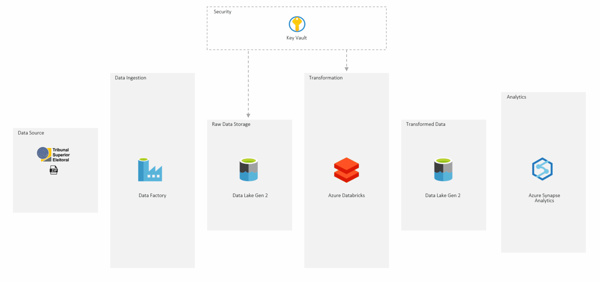
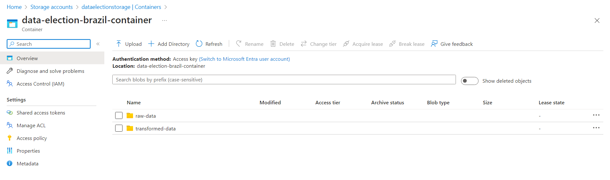
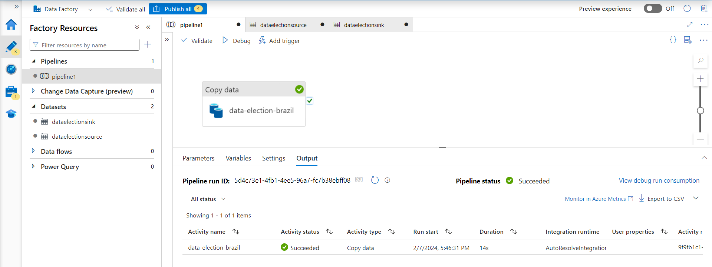
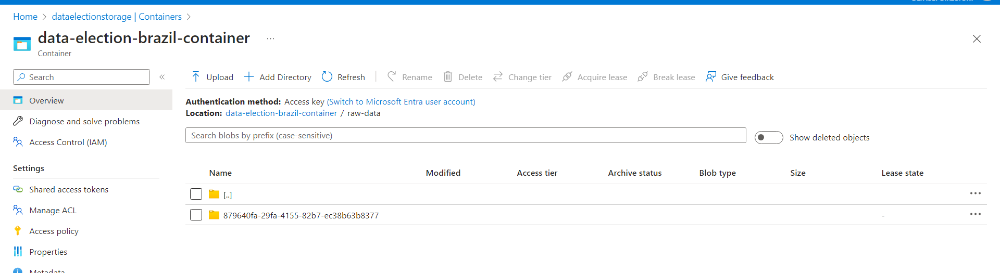
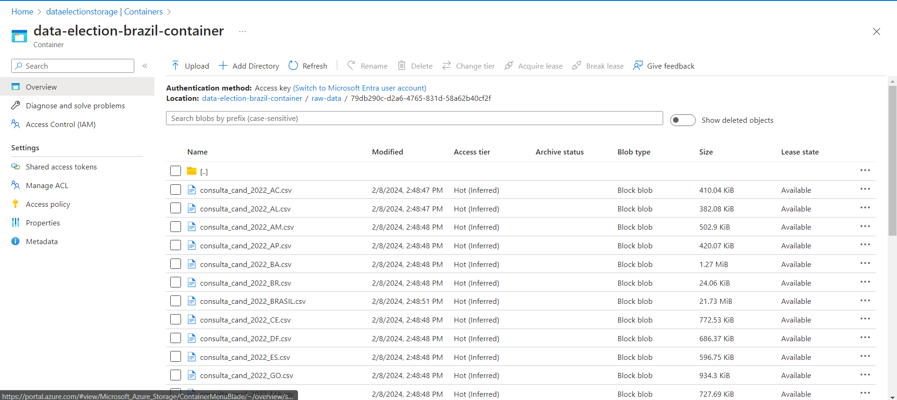
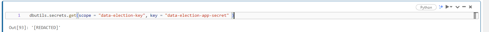
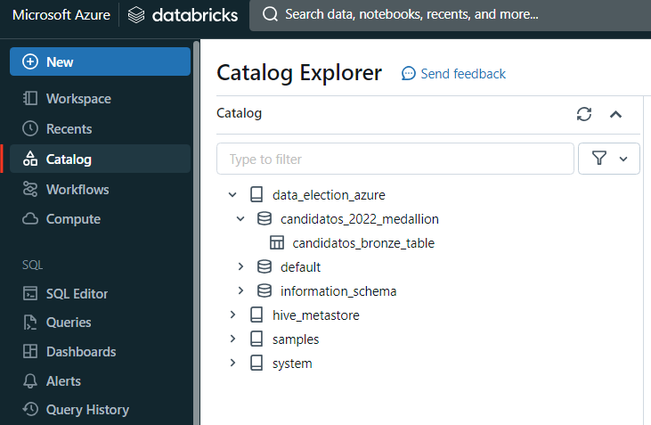
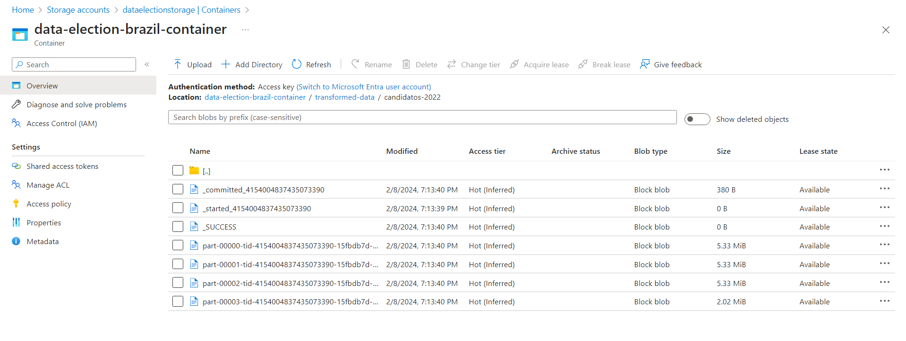
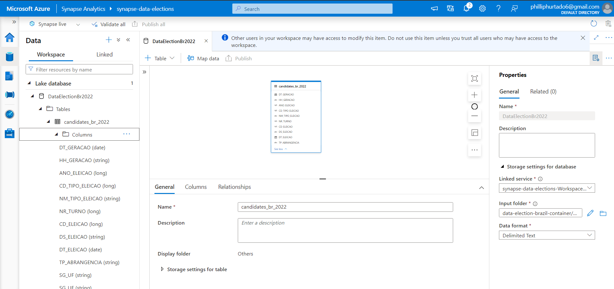
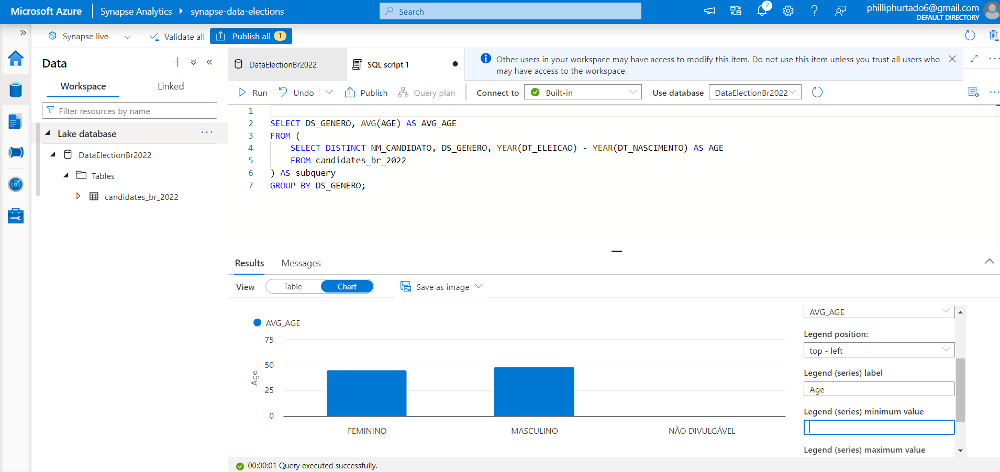

# Brazilian Elections Candidates in 2022 | Azure End-To-End Data Engineering Project

This project provides a data engineering journey on the Brazilian election of 2022 dataset. Starting with a zip file from Superior Electoral Court (Brazilian Electoral Justice) , the data is ingested into the Azure ecosystem via Azure Data Factory. It's initially stored in Azure Data Lake Storage Gen2, then transformed in Azure Databricks. The enriched data, once again housed in ADLS Gen2, undergoes advanced analytics in Azure Synapse. 

## Architecture

  
 

## Dataset Used 
This contains the details of over Federal and State candidates, with 28909 candidates.
This dataset contains the details of the candidates such as names, age, political party, electoral coalition etc.

Source(TSE): [Federal and States Candidates in 2022 elections](https://dadosabertos.tse.jus.br/dataset/candidatos-2022/resource/435145fd-bc9d-446a-ac9d-273f585a0bb9)

## Azure Services Used
1. **Azure Data Factory:** For data ingestion from TSE website.
2. **Azure Data Lake Storage Gen2**: As the primary data storage solution.
3. **Azure Databricks:** For data transformation tasks.
4. **Azure Key Vault:** For security of secret key value.

## Workflow 

## Initial Setup in Azure
1. Create Azure account (Free Subscription)  
2. Create a Resource Group 'data-election-brazil' to house and manage all the Azure resources associated with this project. 
3. Within the created resource group, setup a storage account. This is specifically configured to leverage Azure Data Lake Storage(ADLS) Gen2 capabilities.
4. Create a Container inside this storage account to hold the project's data. Two directories 'raw-data' and 'transfromed-data' are created to store raw data and transformed data.
   

## Data Ingestion using Azure Data Factory
1. First, created an Azure Data Factory workspace within the previously established resource group (data-election-brazil).
2. After setting up the workspace, launch the Azure Data Factory Studio. 
3. Upload the Election-Candidates dataset from TSE portal.
4. Within the studio, initialize a new data integration pipeline. 
   - Configuring the Data Source with HTTP template as we are using http request to get the data from web site.
   - Establishing the Linked Service for source.
   - Configuring the File Format as 'Binary' and Compression 'Zipdeflate'. For setting up the Linked Service Sink just as 'Binary' and file path (raw-data folder).

  
5. After the pipeline completes its execution, navigate to your Azure Data Lake Storage Gen2. Dive into the "raw_data" folder and subfolder with the CSVs. 

The zip file returns as a subfolder within the CSVs:

## Data Transformation using Azure Databricks
1. Navigate to Azure Databricks within the Azure portal and create a workspace within the previously established resource group and launch it.
2. Configuring Compute in Databricks
3. Create a new notebook within Databricks and rename it appropriately, reflecting its purpose or the dataset it pertains to.
4. Establishing a Connection to Azure Data Lake Storage (ADLS) using App Registration.
   - Create a new registration;
   - Copy the credentials (Client ID, Tenant ID), to later write the appropriate code in the Databricks notebook to mount ADLS.
   - In Certificate & Secrets: create a secret for later on store in in the Key Vault, for security purposes.

5. Using Key Vault in the Azure account for Secure key protecting:
   - In Key Vault, create a key vault with the same resource used before;
   - In the IAM add roles: Secret Officer with the member as your User and Secrets User with the member as 'AzureDatabricks'.
   - Now in the 'Secrets', generate a secret with the App Registration Key secret, name it and create.
   - This Key Vault will secure your secret key so it exposed in the mount code.

6. In Databricks, created a secret scope:
  - To create it, substitute go to https://<databricks_instance.net>#secrets/createScope;
  - Create a Scope using the DNS and Resource ID from the Key Vault properties.   

7. Writing Data Transformations mount ADLS Gen2 to Databricks.
   - Within the code using python with OS library, removed files that were not used. (code is provided in the reference below)
   - Create a dataframe (pyspark), transformed columns with the correct datatype and created table within a database to query.

  

  <i>Database and Table in Databricks Catalog</i>

8. Writing Transformed Data to ADLS Gen2
   - Folder is create in the container with the partitioned files

Refer below notebook to transformations and code used to mount ADLS Gen2 to Databricks.

[Election-Brazil-Transformation.ipynb](https://github.com/felipe-de-castro/end-to-end-azure-project-elections-brazil-2022/blob/main/Data_Election_Transformation.ipynb)

## Setting Up and Using Azure Synapse Analytics

1. Creating a Synapse Analytics Workspace.
2. Within Workspace navigate to the "Data" section , choose "Lake Database" and create a Database "DataElectionsbr2022"
3. Creating Table from Data Lake from the Transformed Data folder within your ADLS Gen2 storage.

